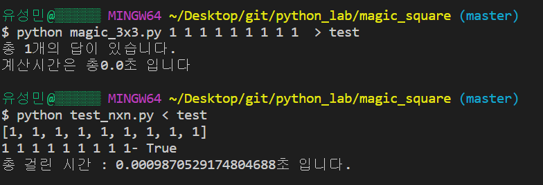
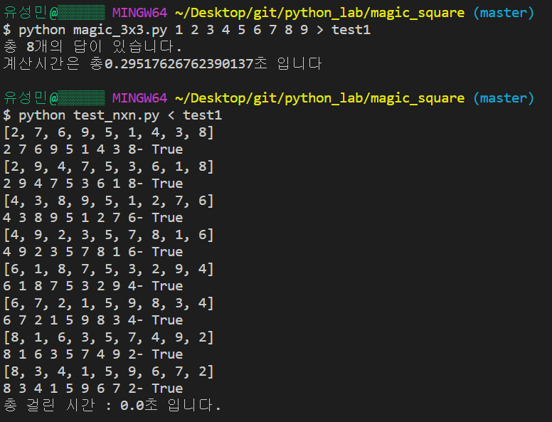
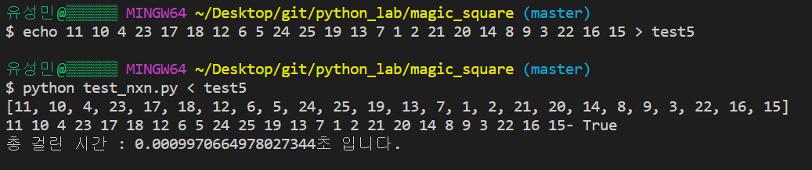
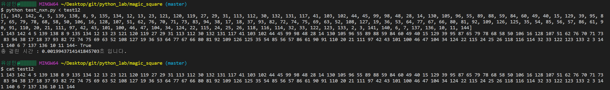
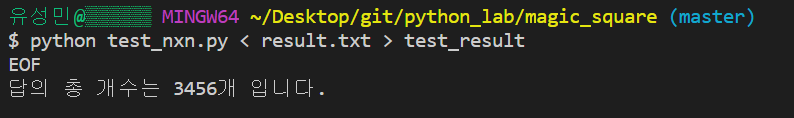
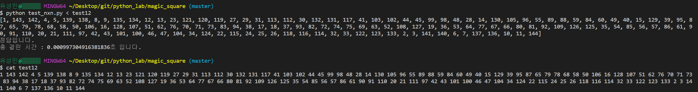

# 기말과제 홀수 마방진
+ contents
    - 프로젝트에 대한 설명
    - 코드에 대한 설명
    - 테스트 실행 결과

## 3 x 3 마방진
+ requirement
```
3x3 마방진 - magic_3x3.py (가로/세로/대각선의 합이 같음, 입력숫자는 한번씩만 사용)
입력숫자를 input 명령으로 사용자가 자유롭게 입력할 수 있도록 한다. 
1 1 2 2 3 3 4 4 5 
출력은 각각의 답을 한줄로 stdout 으로 다음 예와 같이 출력하고
2 1 3 2 1 4 2 3 5
stderr에 다음과 예와 같이 출력한다. 
총 1 개의 답이 있습니다. 계산시간은 총 3.45 초 입니다. 
```
+ Explanation
1. 입력으로 9개의 숫자를 받는다. 
2. 입력받은 것은 문자열이므로 `str.split()`함수를 사용하여 문자로 parsing한 결과를 리스트로 만든다.
3. `map()`함수를 사용하여 리스트의 문자들을 int형으로 변환한다.
4. `count()`함수
    + `permutaions()`함수에 들어가서 리스트 원소들로 이루어진 순열을 만든다.
    + 해당 순열이 마방진 조건을 만족하면 답이므로 답의 갯수를 +1 시키고 정답을 출력한다.
5. 최종적 답의 수와 걸린 시간 stderr로 출력한다.

## 4 x 4 마방진
+ requirement
```
4x4  마방진 - magix_4x4.py (가로/세로/대각선과 1사분면, 2사분면, 3사분면, 4사분면의 합이 모두 같음, 입력된 숫자는 한번 만 사용, 만일 중복된 숫자가 있으면 중복된 횟수만큼 사용)
입력숫자를 input 명령으로 사용자가 자유롭게 입력할 수 있도록 한다. 
예)  1 2 3 4 5 6 7 8 9 10 10 11 13 14 14 15
출력은 각각의 답을 한줄로 stdout으로 다음과 같이 모두 출력한다.
예) 1 14 14 4 11 7 6 9 8 10 10 5 13 2 3 15
stderr에 다음 예와 같이 출력한다. 
총 XX 개의 답이 있습니다. 계산시간은 총 Y.YYYY 초 입니다.
```
+ Explanation
1. 접근 방식은 확인해야 하는 최소 단위인 4개의 수열로 이루어진 부분수열 4개로 divide 하였고 마지막과정에서 conqure하면서 알고리즘은 divide and conqure방식이라고 할 수 있다.
2.  16길이의 원래 입력 받은 수열을 `copy.copy`를 이용해 얕은 복사를 한다.
3.  길이 4인 permutations을 총 4번에 걸쳐서 뽑는다. 뽑을 때마다 linesum과 같은지 보고 같지 않으면 필터링한다.
4.  그리고 16P4를 하여 4개 Permutations 수열을 생성한다
5.  그리고는 다시 이 수열을 복사한뒤 길이 16짜리 배열을 만든 뒤에, 위에서 뽑은 4개의 수를 제외하고 길이를 12로 만든다.
6.  여기서 다시 12P4를 하여 길이 4인 permutations 수열을 생성한다.
7.  이제 정답후보의 0행과 1행이 생성된 것이다. 여기서 확인하고 넘어가야할 점은 0행과 1행의 합이 같은가와, 1사분면 2사분면의 합이 같은가 이다.
8.  만약 다르다면 continue로 loop를 제어하여 다시 새로운 permutation을 생성하여 조건을 만족할 때 까지 반복한다.
9.  이제 조건을 만족하면 3행을 뽑을 차례이다. 위와 과정과 마찬가지로 길이 12수열을 복사하여 1행에서 사용된 4개를 제외하여 길이 8인수열을 만든다.
10. 마지막으로 3행을 뽑을 차례이다. 길이 8인 수열에서 4개를 뽑아서 3행을 만든다
11. 마방진 조건을 보기전에 3사분면과 4사분면의 합이 같은지부터 확인한다.
11. 이제 4 x 4 행렬이 만족되었으므로 마방진의 조건을 만족하는지 검사할 차례이다.
12. 각 행을 담고있는 변수 step1, step2, step3, step4를 이용한다. 이것은 길이가 4인 list이다.
13. 각 행의 합 == 각 열의 합
14. 행의 합 == 두 대각선 합
15. 1,2사분면합 == 3,4분면합 까지 같다면
16. 마방진을 만족하는 것이므로 정답으로 출력하고, 정답의 개수인 count를 센다.

## test n x n 마방진

+ requirement
```
입력은 1 로 나온 stdout 결과를 그대로 사용한다. 반드시 EOF에 대하 에러 처리가 있어야 함 
입력 숫자의 개수가 홀수n에 대해 n x n개가 아니면 False
input으로 입력된 n x n의 숫자를 str.split()으로 분리하고 int()로 변경하여 사용
가로 세로 대각선의 합이 같으면 True 다른것이 있으면  False
출력은 stdout으로 결과를 다음예와 같이 출력한다. 
2 1 3 2 1 4 2 3 5 - False
특별 점수 5점 - 만일 n x n 마방진을 n 값을 큰 수(예 11)를 처리 할 수 있도록 처리하고 결과를 함께 제출한 경우 5점을 추가로 받을 수 있음 
```
+ Explanation
1. 입력으로 제곱수 길이의 수열을 입력받는다. (제곱수 길이가 아니면 마방진이 아니므로 프로그램을 종료 시킨다.)
    + 입력은 길이 제한이 없이 제곱수 이기만하면 진행되도록 코딩하였다.
    + sqrt(n) == int(sqrt(n))를 사용하면 제곱수이다. 왜냐면 제곱수는 루트를 씌우면 정수부분만 남아서 조건이 만족된다.
2. `readlines()`함수를 사용하여 `stdin`을 `eof`까지 1줄 단위로 읽어들인다.
3. `map()`과 `str.split()`을 사용하여 list의 모든 요소를 int로 바꾼다.
4.  행렬연산에 최적화 된 numpy 패키지를 이용한다.
5. 입력을 1 x n^2 크기의 행렬로 받았으므로 `reshape(n,n)`함수를 사용하여 n x n 행렬로 모양을 변형한다.
6. `sum_matrix()`함수는 매개변수로 arr, axis, options(keyword argument)를 받는다.
    + options = False일때는
        - axis = 0이면, arr행렬의 각 행의 합을 구한다.
        - axis = 1이면, arr행렬의 각 열의 합을 구한다.
    + options을 True일때는
        - 각 행의 합을 구하지 않고, 각 행의 합의 평균을 구하는데 마방진이라면 각 행의 합과 평균이 같다.
7. `check_sum_is_same()`함수는 sum_maxtrix의 결과(list형태)를 받아서 모든 리스트의 요소가 같은지 확인한다.
    + 즉 모든 행이나 열의 합이 같은 값이 나왔는지 체크하는 기능이다.
8. `sum_digonal_matrix()`함수는 행렬의 `\` 방향 대각선의 합과 `/`방향 대각선의 합을 구한다.
    + `numpy의 flip()`은 행렬을 열기준으로 180도 대칭하는 기능을 갖는다.
    + `numpy의 trace()`는 행렬의 `\` 방향 대각선 합을 구해주는 기능을 갖는다.
    + direction = 0일 때는
        - / 방향의 합을 구하는 방법은 행렬을 열기준으로 180도 대칭하고, '\'대각선 합 구하면 끝
    + direction = 1일 때는
        - \ 방향의 합을 구한다.
9. 이제 위의 함수들을 사용하여 각 행의 합, 각 열의 합 그리고 두 대각선의 합이 같은지 체크한다
    + 과정을 보면 아래 코드와 같다.
```python
if(check_sum_is_same(sum_matrix(magic_square,1))): # 행
            if(check_sum_is_same(sum_matrix(magic_square,0))): # 열
                if(sum_digonal_matrix(magic_square,0) == sum_digonal_matrix(magic_square,1)): # 두 대각선
                    if(sum_digonal_matrix(magic_square,0) == sum_matrix(magic_square,0,True) == sum_matrix(magic_square,1,True)):
                    # 최종적으로 나온 행의 합 평균 = 열의 합 평균 = 대각선의 합이 같으면 마방진
                        print('정답입니다.')
```
10. 걸린 시간을 출력하고 종료한다.

## result
+ test 3x3



+ test 3x3



+ test 5x5



+ test 12x12



+ 마방진 4x4 3456개 테스트






    
